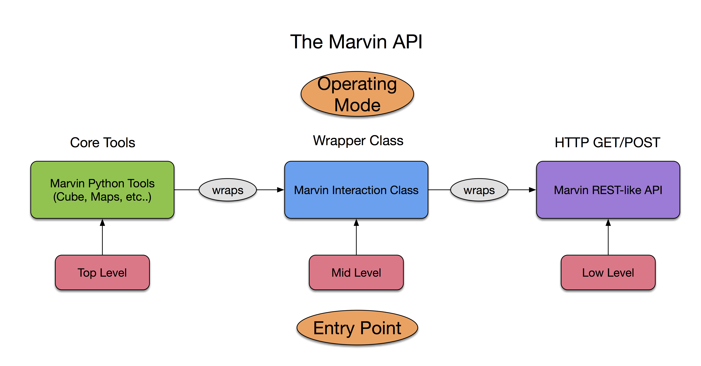

.. _marvin-api:

API
===

.. note:: Redo to describe the 3 ways of using the API

API stands for Application Programming Interface.  It describes a set of rules designed to faciliate remote acquisition of data, without using a user interface.  It is typically designed as a set of HTTP Request methods (i.e. GET or POST), that you can interact with in a browser, or via code packages, e.g. the Python package `Requests <http://docs.python-requests.org/en/master/>`_.  These URL routes, along with all their parameters, can sometimes be tedious to deal with explicitly.

.. _marvin-apilevels:

Marvin API
----------

Marvin has three entry points into the API, each providing different levels of fine-grain control over the data. See the figure below for a visual guide to the Marvin API.

* **Low Level**: This level is direct API access to the HTTP routes.  This gives you direct access to the data in a code agnostic way, completely outside of Marvin.  Use this level if you are comfortable with interacting with JSON data objects, and wish to integrate the raw data directly into your workflow scripts.  See :ref:`marvin-api-routes` for a list of the routes available in the Marvin API.

* **Mid Level**: Marvin wraps some of the explicit nature of dealing with HTTP requests into a convenient Python :ref:`marvin-interaction-class`, making it easier to make the API calls if you want. Use this mode if you don't want to write straight requests but would still prefer to access the data directly.

* **Top Level**: All Marvin Tools have an API call built in when interacting in 'remote' mode, that uses the :ref:`marvin-interaction-class` already, so you don't have to.  This is most of Marvin.  It is recommended to use this mode for complete ease.

With the Marvin API, you can build your own application, website, or workflow scripts very easily, and forego the rest of Marvin, if so desired.  Currently all API requests will timeout after 5 minutes.

|



|


.. _marvin-api_gettingstarted:

Getting Started
---------------

To use the Marvin API, you must have a **.netrc** file in your local home directory following from the installation instructions.  See :ref:`marvin-authentication`.  Let's see how to access the data for a cube along each of the three entry points.  In each example we will be accessing the data for the MPL-5 version of plate-ifu **8485-1901**.

Top Level
^^^^^^^^^
To use the top level API, simply use Marvin in all its glory.

::

    # import the Cube tool
    from marvin.tools.cube import Cube

    # load 8485-1901 remotely
    cube = Cube(plateifu='8485-1901', mode='remote')


Mid Level
^^^^^^^^^
To use the mid level API, your main two tools are the Marvin :ref:`marvin-interaction-class` and Marvin's URL map (:ref:`marvin-urlmap`)

Low Level
^^^^^^^^^
To use the low level API, all you need is the HTTP route of the data you wish to access and an appropriate program to perform the request, like **curl** (link), **httpie** (links), or Python `Requests <http://docs.python-requests.org/en/master/>`_. to make HTTP calls.  All of Marvin's HTTP routes return a JSON dictionary containing a specific key called **data**.  The **data** key contains whatever content is returned by the route, e.g. a single string output, or a dictionary containing cube or map properties.

In the following example we will

With the command-line curl:

::

    # use curl to make a POST request
    curl stuff

With the command-line http:

::

    # use http to make a POST request
    http api.sdss.org/marvin/api/cubes/8485-1901/ -v release=MPL-5


With Python requests:

::

    # import the requests package
    import requests

    # set the url
    url = 'https://api.sdss.org/marvin/api/cube/8485-1901/'

    # submit the request as a POST request
    response = requests.post(url)

    # check the status code is 200 for OK
    response.status_code

    # retrieve the JSON data from the response.  This is like a Python dictionary.
    json_data = response.json()

    # retrieve the data for plateifu 8485-1901 from the JSON
    data = json_data['data']
    print(data)


.. _marvin-urlmap:

config.urlmap
-------------

The marvin.config.urlmap is a nested lookup dictionary that contains all of the API routes used in Marvin.  If you have a connection
to the internet, upon intial import, Marvin will attempt to build the urlmap by contacting Marvin at Utah.  With a valid
internet connection, and config.sasurl variable, Marvin will populate the urlmap with all of the API routes available to use.

The API routes are contained in a key called **api**.  The list of available API endpoints are available as dictionary keys, with the urls for each endpoint available in the dictionary key **url**.

Urlmap Syntax: config.urlmap[**page**][**endpoint**][**url**]

* **page**: The specific page you want to look at.  For the API, this key is **api**.
* **endpoint**: A shortcut name pointing to the URL route defined on that method.
* **url**: The string url path needed to pass into the Marvin Interaction class

Usage
::

    from marvin import config

    # look at available urlmap API endpoints
    print(config.urlmap['api'].keys())
    [u'getroutemap', u'querycubes', u'getCube', u'getspectra', u'getparams', u'getspaxels', u'getSpaxel', u'mangaid2plateifu', u'getRSS', u'getPlate', u'getPlateCubes', u'webtable']

    # get the URL for getting basic Cube properties
    url = config.urlmap['api']['getCube']['url']

    # print(url)
    u'/marvin/api/cubes/{name}/'

Some urls require parameters passed to them. Others do not.  Urls with curly braces {} in them indicate an input parameter. For example, in the above url, ```{name}``` means a parameter called name must be passed into the url. See how to pass in parameters in the examples below.

.. _marvin-authentication:

API Authentication
------------------

The use of the API requires authentication.  To authenticate, you will need to have a .netrc file in your local home directory.  Inside the .netrc file,
::

    # create a .netrc file if you do not already have one
    cd ~/
    touch .netrc

    # using a text editor, place the following text inside your .netrc file.
    machine api.sdss.org
        login sdss
        password replace_with_sdss_password

.. _marvin-interaction-class:

Interaction Class
-----------------

If you want to explicitly grab the data remotely outside of Marvin Tools, you can do so with the :ref:`marvin-api-interaction` class. This class, in combination with the Marvin :ref:`marvin-urlmap`, allows you to easily make API requests and retrieve the results.  The Interaction class returns data in a basic JSON format and translates it to a more user-friendly python data types (e.g. numpy arrays).


Usage:
::

    from marvin import config
    config.mode = 'remote'

    # import the Marvin Interaction class
    from marvin.api.api import Interaction

    # get and format an API url to retrieve basic Cube properties
    plateifu = '7443-12701'
    url = config.urlmap['api']['getCube']['url']

    # create and send the request, and retrieve a response
    response = Interaction(url.format(name=plateifu))

    # check your response's status code
    print(response.status_code)
    200

    # get the data in your response
    data = response.getData()
    print(data)


Http Status Codes
-----------------
These tell you whether or not your request was successful.  A status code of 200 mean success.  Any other status code means failure.  If the Interaction requset fails, you will receive a dictionary containing the status code, and an error message.

Status Codes:

* **200**: OK
* **404**: Page Not Found - the page connected to the input route does not exist
* **500**: Internal Server Error - something has gone wrong on the server side
* **405**: Method Not Allowed - the route is using the wrong method request, e.g. GET instead of POST
* **401**: Authentication Required - the correct authentication credentials was not provided
* **422**: Unprocessable Entity - the input parameters are invalid
* **400**: Bad Request
* **502**: Bad Gateway
* **504**: Gateway Timeout
