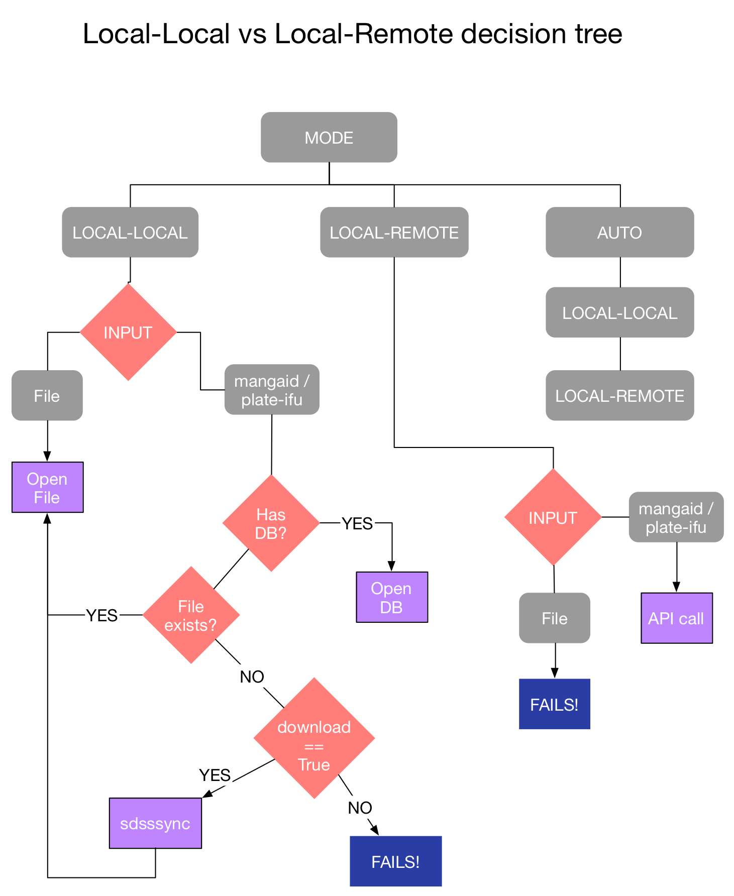

.. _marvin-dam:

Data Access Modes
=================

.. _auto-mode:

Auto Mode
---------

This is the default mode for Marvin.  It is recommended to leave Marvin in this mode and let it handle everything.  When in Auto mode, Marvin will always first try to access data in `Local Mode`_, and if that attempt fails, it automatically switches to `Remote Mode`_ .

.. _local-mode:

Local Mode
----------

In Local mode, :ref:`marvin-tools` will access data stored locally on your
machine. If you specify a file name, then it will open that file. Alternatively,
you can provide a MaNGA-ID or a plate-IFU identifier. Marvin will check to see
if you have a database (e.g., running :ref:`marvin-tools` at Utah) and use that
if possible. More likely, you will not have access to the database, so it will
look for a FITS file. If neither of those options is successful, then it will
download the requested data if automatic downloading is enabled.

Explicit Filename
::

    import marvin
    from marvin.tools.cube import Cube
    marvin.config.mode = 'local'

    # loads a cube from an explicit filepath
    cc = Cube(filename='/Users/Brian/mycubes/manga-8485-1901-LOGCUBE.fits.gz')

Local SAS
::

    import marvin
    from marvin.tools.cube import Cube
    marvin.config.mode = 'local'

    # checks for file in your local SAS. If found, loads it.  If not, may download it.
    cc = Cube(plateifu='8485-1901')

.. _remote-mode:

Remote Mode
-----------

In Remote mode, :ref:`marvin-tools` will retrieve the data remotely via the
:ref:`marvin-api`.  When dealing with Marvin Tools like Cubes or Spaxels, if a MaNGA-ID or a plate-IFU identifier
is provided, a remote API call is made to Marvin running at Utah, where it retrieves the data requested
and returns it as a JSON object.  Once the data has been acquired, the Marvin Tool object you are dealing with
will work as if you had the data locally.

When working in remote mode, data is lazy loaded.  This means it only grabs the bare minimum you need.
New data are grabbed on demand.

::

    import marvin
    from marvin.tools.cube import Cube
    marvin.config.mode = 'remote'

    # grabs the necessary information from Utah, returns it to instantiate the Cube tool
    cc = Cube(plateifu='8485-1901')

.. _mode-decision-tree:

Mode Decision Tree
------------------

|

|
