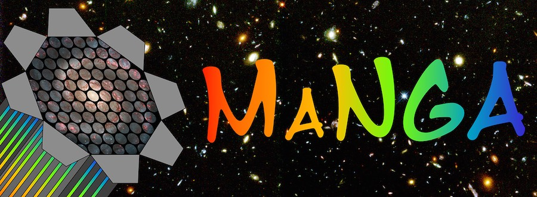

.. Marvin documentation master file, created by
   sphinx-quickstart on Sun Apr 10 08:50:42 2016.
   You can adapt this file completely to your liking, but it should at least
   contain the root `toctree` directive.

.. role:: header_no_toc
  :class: class_header_no_toc

.. title:: Marvin documentation

:tocdepth: 2

|

.. rubric:: :header_no_toc:`Welcome to Marvin's documentation!`

Marvin is the ultimate tool to visualise and analyse MaNGA data. It is
developed and maintained by the MaNGA team.  Check out the
`Marvin Github <https://github.com/sdss/marvin>`_ page.

If you are using Marvin in any way (Web, API, or Tools) to do your science, please
remember to :ref:`acknowledge and cite<marvin-citation>` us in your paper!

|

Introduction
============

* :doc:`What's New in Marvin <whats-new>`
* :doc:`Changelog <changelog>`
* :ref:`Known issues <marvin-known-issues>`
.. * :ref:`TODOs <marvin-todo>`

|

Marvin at a Glance
==================

* :doc:`overview`
* :doc:`installation`
* :doc:`faq`
* :doc:`getting-started`
* :doc:`tutorials`
* :doc:`exercises`
* :doc:`cheatsheet`
* :doc:`contributing/contributing`

|

Components
==========

* :doc:`core`

  * :doc:`core/config`
  * :doc:`core/data-access-modes`
  * :doc:`core/downloads`
  * :doc:`tools/quantities`

* :doc:`tools`

  * :doc:`query`
  * :doc:`results`
  * :doc:`tools/plate`
  * :doc:`tools/image`
  * :doc:`tools/cube`
  * :doc:`tools/modelcube`
  * :doc:`tools/maps`

    * :doc:`tools/bpt`

  * :doc:`tools/map`

    * :doc:`tools/enhanced-map`

  * :doc:`tools/spaxel`
  * :doc:`tools/bin`

  * :doc:`tools/metadata`

  * :doc:`utils`

    * :doc:`Image <utils/images>`
    * :doc:`Map Plotting <utils/plot-map>`
    * :doc:`Scatter Plotting <utils/plot-scatter>`
    * :doc:`Histogram Plotting <utils/plot-hist>`
    * :doc:`Maskbit <utils/maskbit>`

* :doc:`api`

* :doc:`web`

* :doc:`datamodel/datamodels`

  * :doc:`datamodel/dr15`
  * :doc:`datamodel/mpl7`
  * :doc:`datamodel/mpl6`
  * :doc:`datamodel/mpl5`
  * :doc:`datamodel/mpl4`

|

.. General Reference
.. =================

.. .. toctree::
..    :titlesonly:
..    :maxdepth: 1

..    maps-properties-channels
..    Available Query Parameters <query-params>
..    tools/visual-guide

|

API/Code Reference
==================

.. toctree::
   :maxdepth: 1

   api/general
   api/api
   api/tools
   api/mixins
   api/quantities
   api/queries
   api/utils
   api/web
   api/db
   api/brain/api
   api/brain/utils

|

Indices and tables
==================

* :ref:`genindex`
* :ref:`modindex`

.. * :ref:`search`
