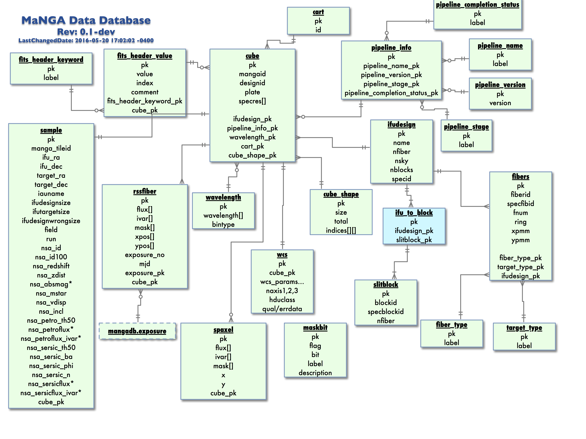
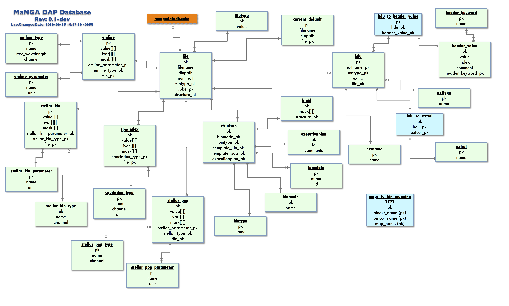
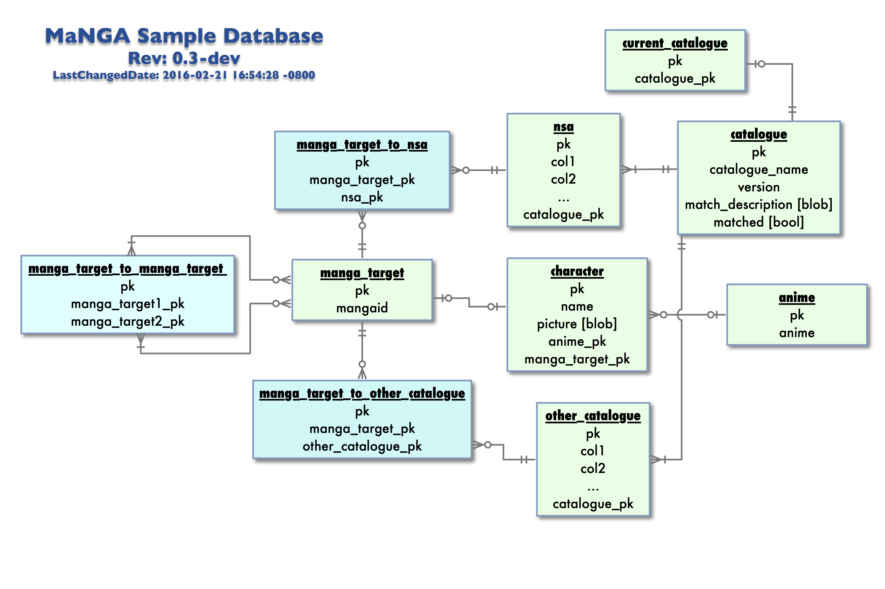

.. _marvin-databases:

Databases
=========

Marvin relies heavily on databases throughout itself.  Databases allow for fast access to data across the entire sample, and can be
constructed to easily extract complex sets of data, or complete complex tasks.  All Marvin Queries, Marvin API calls, and Marvin Web
functionality use the databases at Utah.

.. _marvin-datadb:

MangaDataDb
-----------

The MangaDataDb contains the information on the MaNGA DRP data products, such as the Cubes and RSS files.  It stores both MetaData
and raw Spaxels and RSS Fiber data.  The schema for this database is

.. _marvin-dapdb:

MangaDapDb
----------

The MangaDapDb contains the information on the MaNGA DAP data products, such as the MAPS files.  It stores both MetaData
and the MAPS extensions on emission lines, stellar kinematics, and spectral indices.  The schema for this database is

.. _marvin-sampledb:

MangaSampleDb
-------------

The MangaSampleDb contains the information on the MaNGA Targeting sample, and all auxillary and ancillary catalogs, such as the NSA
catalog.  The schema for this database is

|
