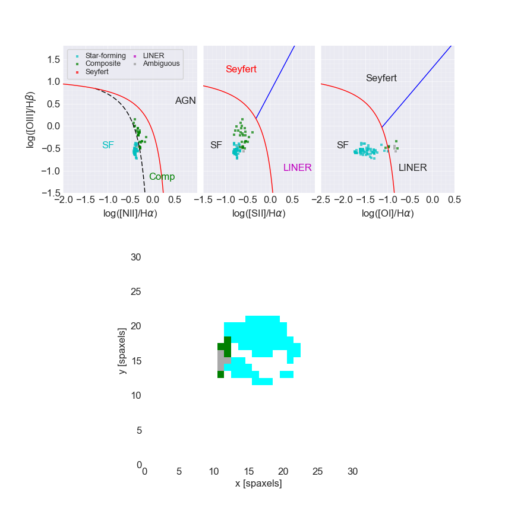

.. _marvin-bpt:

BPT diagrams
============

Marvin now includes the ability to generate BPT (`Baldwin, Phillips, & Terlevich 1981 <https://ui.adsabs.harvard.edu/#abs/1981PASP...93....5B/abstract>`_) diagrams for a particular galaxy.  Marvin makes use of the classification system defined by |kewley2006|_  to return classification masks for different ionisation mechanisms.  By default, the Marvin BPT uses a strict selection criteria, utilizing all three BPT diagnostic criteria (NII, SII, and OI) from |kewley2006|_.  A spaxel only becomes classified if it meets the criteria in all three.

The BPT spaxel classifications that Marvin provides are

* **Star-Forming (sf)**:
    Spaxels that fall in the |kewley2006|_ star-forming region in the SII and OI BPTs, and the |kauffmann2003|_ star-forming region in the NII BPT.

* **Composite (comp)**:
    Spaxels that fall in the |kewley2006|_ star-forming region in the SII and OI BPTs, and between the |kauffmann2003|_ star-forming region and the |kewley2006|_ star-forming region in the NII BPT.

* **AGN (agn)**:
    Spaxels that fall in the AGN region in all three BPTs.

* **Seyfert (seyfert)**:
    Spaxels that fall in the AGN region in all three BPTs, and the Seyfert region in both the SII, and OI BPTs.

* **LINER (liner)**:
    Spaxels that fall in the AGN region in all three BPTs, and the LINER region in both the SII, and OI BPTs.

* **Ambiguous (ambiguous)**:
    Spaxels that cannot be strictly classified in one of the given categories.

* **Invalid (invalid)**:
    Spaxels that have emission line flux <= 0 or are rejected by any signal-to-noise ratio (SNR) cuts.

Often the OI diagnostic line cannot be reliably measured.  If you wish to disable the use of the OI diagnostic line when classifying your spaxels, use may set the ``use_oi`` keyword to ``False``.  This turns off the OI line, and only uses the NII and SII BPTs during classification, giving you more spaxels to play with.

By default, :meth:`~marvin.tools.maps.Maps.get_bpt` produces and returns a matplotlib figure with the classification plots **(based on |kewley2006|_ Fig. 4)** and the 2D spatial distribution of classified spaxels (i.e., a map of the galaxy in which each spaxel is colour-coded based on its emission mechanism).  To disable the return of the figure, set the ``return_figure`` keyword to ``False``.

See :meth:`~marvin.tools.maps.Maps.get_bpt` for the API reference of how to generate a BPT diagram from within :ref:`marvin-tools-maps`.  See :ref:`marvin-utils-bpt` for the API reference guide on the BPT utility code.

::

    # get a map
    from marvin.tools.maps import Maps
    maps = Maps(plateifu='8485-1901')

    # make a standard 3-plot BPT and retrieve the classifications
    masks, fig = maps.get_bpt()
    
    # save the plot
    fig.savefig('bpt.png')

    # make a BPT classification without OI
    masks, fig = maps.get_bpt(use_oi=False)

    # also show the optical image
    from marvin.utils.general.images import showImage
    image = showImage(plateifu='8485-1901')

    # only return the masks (good for batch jobs)
    masks = maps.get_bpt(return_figure=False, show_plot=False)

    # give me the masks and figures, but don't show me the plot (good for batch jobs)
    masks, fig = maps.get_bpt(show_plot=False)

Signal-To-Noise Cuts
--------------------

Marvin's BPT code allows you to impose a cut on SNR over any or all of the emission line diagnostics used in spaxel classification.  Marvin accepts either a single number, which will be applied to all emission lines, or a dictionary of values for specific emission lines.  **Marvin uses a default minimum SNR of 3.**

When using a dictionary to define your minimum SNR, it takes the form of ``{emission_line: snr_min}``.  The emission lines available are ``ha``, ``hb``, ``nii``, ``sii``, ``oiii``, and ``oi``.  Any lines not specified in the dictionary take on the default value of 3.

::

    maps = Maps(plateifu='8485-1901')

    # generate a bpt plot using a sinlge minimum SNR of 5
    masks, fig = maps.get_bpt(snr=5)

    # generate a bpt plot using a minimum Halpha SNR of 5 and a minimum SII SNR of 2.  The remaining lines have minimum SNRs of 3.
    snrdict = {'ha': 5, 'sii': 2}
    masks, fig = maps.get_bpt(snr=snrdict)

Using the Masks
---------------

Marvin always returns the BPT classifications as masks.  These masks are boolean arrays of the same shape as :ref:`marvin-tools-maps`, i.e. 2d-arrays. These masks can be used to filter on any other :ref:`marvin-tools-map` or :ref:`marvin-tools-cube` property.  Marvin returns a dictionary of all the classifications, with two tiers.  At the top level, the BPT mask contains a key for each classfication category.  Within each category, there are four sub-groups, described as follows:

* **global**: the strict spaxel classifications as described above, using all three BPT diagrams
* **nii**: the spaxel classifications using only the NII BPT
* **sii**: the spaxel classifications using only the SII BPT
* **oi**: the spaxel classifications using only the OI BPT

::

    maps = Maps(plateifu='8485-1901')

    # generate a bpt plot and retrieve the masks
    masks, fig = maps.get_bpt()

    # look at the masks included in this dictionary
    print(masks.keys())
    ['agn', 'ambiguous', 'comp', 'liner', 'invalid', 'seyfert', 'sf']

    # each mask is a boolean 2-d array of the same shape as the Maps
    print(masks['sf']['global'])
    array([[False, False, False, ..., False, False, False],
           [False, False, False, ..., False, False, False],
           [False, False, False, ..., False, False, False],
           ...,
           [False, False, False, ..., False, False, False],
           [False, False, False, ..., False, False, False],
           [False, False, False, ..., False, False, False]], dtype=bool)

    print(masks['sf']['global'].shape)
    (34, 34)

    # let's look at the H-alpha EW values for all spaxels classified as star-Forming (sf)

    # get the Ha EW map
    haew = maps.getMap('emline_sew', channel='ha_6564')
    print(haew)
    <Marvin Map (plateifu='8485-1901', property='emline_sew', channel='ha_6564')>

    # select and view the ew for star-forming spaxels
    sfewha = haew.value[masks['sf']['global']]
    print(sfewha)
    array([ 24.24110881,  25.01420788,  24.7991354 ,  23.38512724,
            25.68793683,  25.28550245,  26.52018748,  24.97324795,
            23.08979909,  17.63789628,  23.86850291,  25.90032963,
            25.94885862,  20.35513981,  22.68903799,  24.71221638,
            28.51509129,  29.21568103,  29.02369049,  25.46967313,
            21.32396192,  23.67012794,  26.76387933,  28.51799067,
            28.88143649,  28.33309614,  28.05468761,  27.37624124,
            26.19390898,  23.08294725,  23.17007085,  24.37387385,
            26.04795531,  27.4333648 ,  27.67205947,  27.1107335 ,
            26.73307361,  26.29914273,  26.0940918 ,  19.42565048,
            23.73720102,  24.24404652,  25.0204489 ,  26.0995353 ,
            26.79414024,  26.63586029,  25.87115022,  25.70280123,
            19.22384755,  23.94467764,  24.63271919,  26.0236343 ,
            27.16742326,  28.05049556,  27.81402451,  26.3372375 ,
            25.93436365,  28.79926688,  29.91935251,  30.44388859,
            29.53938287,  27.72750152])

If you want to know the spaxel x, y coordinates for the spaxels in given mask, you can use Numpy's `np.where <https://docs.scipy.org/doc/numpy/reference/generated/numpy.where.html>`_ function.  Using ``np.where`` on a boolean array will return the indices of that array that evaluate to ``True``. **Note that for Maps, np.where returns a tuple of (array of y indices, array of x indices). Numpy stores data in row major ordered**

::

    # get a mask
    masks, fig = maps.get_bpt()

    # get the spaxel x, y coordinates of our star-forming spaxels
    import numpy as np
    y, x = np.where(masks['sf']['global'])
    print(y)
    [12 12 12 13 13 13 13 13 13 14 14 14 14 15 15 15 16 16 16 16 16 17 17 17 17
     17 17 17 17 17 18 18 18 18 18 18 18 18 18 19 19 19 19 19 19 19 19 19 20 20
     20 20 20 20 20 20 20 21 21 21 21 21]
    print(x)
    [16 17 18 13 14 15 16 20 21 12 13 14 15 13 14 21 16 17 18 21 22 14 15 16 17
     18 19 20 21 22 13 14 15 16 17 18 19 20 21 12 13 14 15 16 17 18 19 20 12 13
     14 15 16 17 18 19 20 15 16 17 18 19]

    # alternatively, if you want a list of coordinate pairs of [y, x]
    coordlist = np.asarray(np.where(masks['sf']['global'])).T.tolist()
    print(coordlist[0:2])
    [[12, 16], [12, 17]]

    # using the star-forming HaEW selection from before
    print(sfewha)
    array([ 24.24110881,  25.01420788,  24.7991354 ,  23.38512724,
            25.68793683,  25.28550245,  26.52018748,  24.97324795,
            23.08979909,  17.63789628,  23.86850291,  25.90032963,
            25.94885862,  20.35513981,  22.68903799,  24.71221638,
            28.51509129,  29.21568103,  29.02369049,  25.46967313,
            21.32396192,  23.67012794,  26.76387933,  28.51799067,
            28.88143649,  28.33309614,  28.05468761,  27.37624124,
            26.19390898,  23.08294725,  23.17007085,  24.37387385,
            26.04795531,  27.4333648 ,  27.67205947,  27.1107335 ,
            26.73307361,  26.29914273,  26.0940918 ,  19.42565048,
            23.73720102,  24.24404652,  25.0204489 ,  26.0995353 ,
            26.79414024,  26.63586029,  25.87115022,  25.70280123,
            19.22384755,  23.94467764,  24.63271919,  26.0236343 ,
            27.16742326,  28.05049556,  27.81402451,  26.3372375 ,
            25.93436365,  28.79926688,  29.91935251,  30.44388859,
            29.53938287,  27.72750152])

    # Let's verify this, by looking at the individual spaxel values
    # Since numpy.where returns Numpy 0-based indices, we select spaxels using bracket notation [x, y]

    # let's check the first one y=13, x=16.
    spaxel = maps[x[0], y[0]]
    spaxel.properties['emline_sew_ha_6564']
    <AnalysisProperty (name=emline_sew, channels=ha_6564, value=24.2411088079 ivar=12.1895422809, mask=0)>

    # the value property matches the first element in our sfewha array.
    # Let's check the 2nd one at y=16, x=16
    spaxel = maps[x[1], y[1]]
    <AnalysisProperty (name=emline_sew, channels=ha_6564, value=25.0142078759 ivar=9.57522199793, mask=0)>

    # It matches!

If you want to examine the emission-line ratios up close for spaxels in a given mask, you can do so easily using the rest of the Marvin :ref:`marvin-tools-maps`

::

    # get a mask
    masks, fig = maps.get_bpt()

    # get the nii_to_ha emission-line map
    niihamap = maps.getMapRatio('emline_gflux', 'nii_6585', 'ha_6564')

    # we need Numpy to take the log.  Let's look at the nii_to_ha values for the star-forming spaxels
    import numpy as np
    print(np.log10(niihamap.value)[masks['sf']['global']])
    array([-0.36584288, -0.36719094, -0.35660012, -0.4014837 , -0.40940271,
           -0.38925928, -0.37854384, -0.37854133, -0.3702414 , -0.35243334,
           -0.4063151 , -0.40700583, -0.37816566, -0.32691184, -0.33938829,
           -0.38954354, -0.39481861, -0.39354811, -0.39014752, -0.38456884,
           -0.36997772, -0.34816849, -0.38874181, -0.40622432, -0.4031055 ,
           -0.39180703, -0.38927489, -0.38439859, -0.3867139 , -0.37030788,
           -0.36343103, -0.36707432, -0.38794217, -0.39947496, -0.39955753,
           -0.39139759, -0.38655966, -0.38414232, -0.3820709 , -0.33771159,
           -0.37821421, -0.36919585, -0.375137  , -0.38745702, -0.39792523,
           -0.39382841, -0.38583616, -0.38413919, -0.33190377, -0.38916062,
           -0.38345063, -0.38779218, -0.39944001, -0.4123838 , -0.40705238,
           -0.39332287, -0.38851668, -0.41152218, -0.41904352, -0.42121039,
           -0.4120694 , -0.39626994])

    # how about the ambiguous spaxels?
    print(np.log10(niihamap.value)[masks['ambiguous']['global']])
    array([-0.22995676, -0.3285372 , -0.35113382, -0.36632009, -0.32398985,
           -0.28100636, -0.26962523, -0.27915169])

Ambiguous Spaxels
-----------------

Spaxels that cannot be classified as ``sf``, ``agn``, ``seyfert``, or ``liner`` based on all three BPTs, are classified as ambiguous.  You can determine how ambiguous spaxels were classified in the individual BPT diagrams using the individual BPT masks.

::

    # get the spaxels classified as ambiguous
    ambig = masks['ambiguous']['global']
    y, x = np.where(ambig)
    print(x, y)
    (array([11, 11, 12, 11]), array([14, 15, 15, 16]))

    # we have 4 ambiguous spaxels. why are they ambiguous?

    # let's examine the sub-classes in each bpt for these 4 spaxels
    # by filtering the individual BPT boolean maps using the ambiguous spaxel map

    # they are star-forming in the NII BPT
    masks['sf']['nii'][ambig]
    array([ True,  True,  True,  True], dtype=bool)

    # they are star-forming in the SII BPT
    masks['sf']['sii'][ambig]
    array([ True,  True,  True,  True], dtype=bool)

    # they are not star-forming in the OI BPT
    masks['sf']['oi'][ambig]
    array([False, False, False, False], dtype=bool)

    # they are agn in the OI BPT
    masks['agn']['oi'][ambig]
    array([ True,  True,  True,  True], dtype=bool)

    # If you want a new full 2d-boolean array to use elsewhere, use the bitwise & operator

    niisf_ambig = masks['sf']['nii'] & ambig

Modifying the Plot
------------------

Once you return the BPT figure, you are free to modify it anyway you like.

Things to Try
-------------

Now that you know about Marvin's BPT, try to do these things

* For a given BPT mask, compute an average spectrum using Marvin Spaxel and the BPT spaxel coordinates.

Did you do them? :) Now you can contribute your code into Marvin for others to use.  Hurray!

.. |kewley2006| replace:: Kewley et al. (2006)
.. _kewley2006: https://ui.adsabs.harvard.edu/#abs/2006MNRAS.372..961K/abstract

.. |kauffmann2003| replace:: Kauffmann et al. (2003)
.. _kauffmann2003: https://ui.adsabs.harvard.edu/#abs/2003MNRAS.346.1055K/abstract
