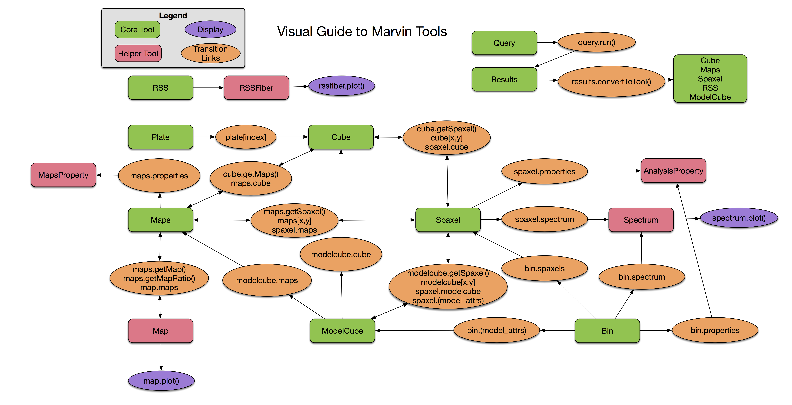

.. role:: rubric-h2
.. role:: rubric-h3

.. role:: green
.. role:: orange
.. role:: red
.. role:: purple

.. py:currentmodule:: marvin.tools

.. _galaxy-tools:

Galaxy Tools
============

Marvin Tools provide the core functionality for accessing MaNGA data with Marvin.  At the lowest level they are class wrappers around data products or elements (DRP datacubes, DAP maps, and spaxels). Their purpose is to provide a more natural way to interact with the data, unconstrained by specific data storage architectures such as files or databases. The tools are built on top of the :ref:`data access modes <marvin-dam>`, which abstracts the data access regardless of their actual origin.  Marvin Tools provide:

- Access to DRP :ref:`Cubes <marvin-cube>` and their spectra.
- Access to :ref:`Row-stacked Spectra <marvin-rss>` files.
- Access to DAP :ref:`Maps <marvin-maps>` and :ref:`ModelCubes <marvin-modelcube>`.
- Convenient access to all the DRP and DAP properties for a given :ref:`Spaxel or Bin <marvin-spaxel>`.
- The data delivered as :ref:`Astropy quantities <marvin-quantities>` with the inverse variance and mask, as well as associated properties.
- Easy handling of maskbits and labels.
- DAP :ref:`Map arithmetic <marvin-enhanced-map>`.
- Autocompletion of properties and channels (powered by a datamodel).
- The ability to extract all spaxels within a region.
- Access to NSA and DRPall data.
- Easy data download.

The following sections explain how to use the tools in detail. They assume that you have read our :ref:`marvin-getting_started` and are familiar with :ref:`Astropy quantities <marvin-quantities>`.

:rubric-h2:`Using the tools`

.. toctree::
    :maxdepth: 2

    cube
    rss
    modelcube
    maps-map
    plate
    spaxel
    image

.. toctree::
    :maxdepth: 2

    ../core/data-access-modes

    downloads
    pickling

    catalogues

    aperture

    utils/maskbit

    datamodel

    utils/plotting
    bpt

    image

.. _visual-guide:

:rubric-h2:`Visual guide`

All **object-** and **search-based** tools in Marvin are linked together. To better understand the flow amongst the various Tools, here is a visual guide.

* The :red:`red squares` and :green:`green squares` indicate the set of Marvin Tools available.
* The :orange:`orange circles` highlight how each Tool links together via a method or an attribute. In each transition link, a lowercase Tool name represents an instantiation of that tool, e.g. ``cube = Cube()``. To go from a Marvin ``Cube`` to a Marvin ``Spaxel``, you can use the ``cube.getSpaxel`` method or the ``cube[x,y]`` notation. Conversely, to go from a ``Spaxel`` to a ``Cube``, you would use the ``spaxel.cube`` attribute. Single or bidirectional arrows tell you which directions you can flow to and from the various tools.
* :purple:`Purple circles` represent display endpoints. If you want to display something, this shows you how which tool the plotting command is connected to, and how to navigate there.

:rubric-h2:`Reference`

:rubric-h3:`Tools`

.. autosummary::

   marvin.tools.cube.Cube
   marvin.tools.rss.RSS
   marvin.tools.maps.Maps
   marvin.tools.modelcube.ModelCube
   marvin.tools.image.Image

:rubric-h3:`Quantities`

.. autosummary::

    marvin.tools.quantities.analysis_props.AnalysisProperty
    marvin.tools.quantities.spectrum.Spectrum
    marvin.tools.quantities.map.Map
    marvin.tools.rss.RSSFiber
    marvin.tools.quantities.datacube.DataCube

:rubric-h3:`MixIns`

.. autosummary::

    marvin.tools.mixins.nsa.NSAMixIn
    marvin.tools.mixins.dapall.DAPallMixIn
    marvin.tools.mixins.aperture.GetApertureMixIn
