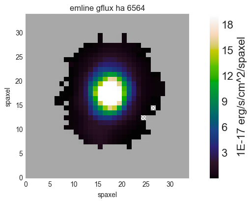

.. _marvin-maps:

Maps
====

Let's get the DAP maps of a galaxy by creating a :ref:`marvin-tools-maps` object from its ``mangaid``, ``plateifu``, or ``filename``. We also need to set our desired ``bintype``, which defaults to ``SPX`` (i.e., unbinned). Now we can get the H\ :math:`\alpha` flux :ref:`marvin-tools-map` object and plot it.

::

    from marvin.tools.maps import Maps
    maps = Maps(mangaid='1-209232', bintype='SPX')
    haflux = maps['emline_gflux_ha_6564']
    fig, ax = haflux.plot()



Here ``maps['emline_gflux_ha_6564']`` is shorthand for ``maps.getMap('emline_gflux', channel='ha_6564')``, where the property and channel are joined by an underscore ('_'). For properties without channels, such as stellar velocity, just use the property name like ``maps['stellar_vel']``.

Version 2.1 introduces a completely refactoring of the :meth:`~.plot` method. Please see the `Changelog <https://github.com/sdss/marvin/blob/master/CHANGELOG.md>`_ for a complete list of changes and new options available, but here a few critical default settings that are now used:

* clips at 5th and 95th percentiles (10th and 90th percentiles for velocity and sigma plots)
* velocity plots are symmetric about 0
* **no data** (gray): either ``ivar = 0`` or DAP bitmasks ``NOVALUE``, ``BADVALUE``, ``MATHERROR``, ``BADFIT``, or ``DONOTUSE`` set
* **no measurement** (hatched): pass **no data** criteria but DAP did not produce a measurement or  signal-to-noise ratio < 1

The DAP data is stored as 2-D arrays in the ``value``, ``ivar``, and ``mask`` attributes of the ``haflux`` :ref:`marvin-tools-map` object.

::

    haflux.value


.. TODO fix ref to marvin-visual-guide

The beauty of Marvin is that you can link to other data about the same galaxy (``` :ref:`marvin-visual-guide` ```). Let's see the spectrum of the central spaxel (x=17, y=17).

::

    spec = maps.cube[17, 17].spectrum
    spec.plot()


.. image:: ../_static/spec_8485-1901_17-17.png


The spectrum data is stored as 1-D arrays in the ``flux``, ``ivar``, and ``mask`` attributes of ``spec`` :ref:`marvin-tools-spectrum` object.

::

    spec.flux

Head on over to :ref:`marvin-cube` to learn more about cube and spectrum-related operations.

|
