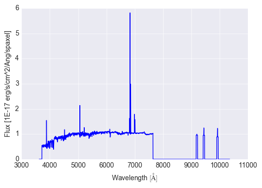

.. _marvin-modelcube:

ModelCube
---------

:ref:`marvin-tools-modelcube` is a class to interact with a DAP model datacube for a galaxy.

.. _marvin-modelcube-initializing:

Initializing
^^^^^^^^^^^^

`ModelCube` behaves in much the same way as a `Cube`.  To initialize a `ModelCube`, you can specify either a **mangaid**, **plateifu**, or **filename** as input.  Marvin will attempt to open the file locally from a file, a database, or remotely over the API.

**Filename**:

.. code-block:: python

    >>> modelcube = ModelCube(filename='/Users/username/manga/spectro/analysis/v2_4_3/2.2.1/HYB10-GAU-MILESHC/8485/1901/manga-8485-1901-LOGCUBE-HYB10-GAU-MILESHC.fits.gz')
    >>> modelcube
    <Marvin ModelCube (plateifu='8485-1901', mode='local', data_origin='file', bintype='HYB10', template='GAU-MILESHC')>

Either the full path or the path relative to the current working directory is required.  A `ModelCube` initialized from a file will always be in `local` mode.

**Plateifu** or **Mangaid**:

.. code-block:: python

    >>> modelcube = ModelCube(plateifu='8485-1901')
    >>> modelcube
    <Marvin ModelCube (plateifu='8485-1901', mode='local', data_origin='db', bintype='HYB10', template='GAU-MILESHC')>

    >>> modelcube = ModelCube(mangaid='1-209232')
    >>> modelcube
    <Marvin ModelCube (plateifu='8485-1901', mode='local', data_origin='db', bintype='HYB10', template='GAU-MILESHC')>

Marvin first attempts to find the data in a local database, otherwise will retrieve the data in `remote` mode.

**Smart Galaxy Lookup**

You can also initialize a `ModelCube` without the `filename` or a galaxy identifier (`plateifu`/`mangaid`) keyword argument, and Marvin will attempt to parse the input and find the desired galaxy:

.. code-block:: python

    >>> modelcube = ModelCube('8485-1901')
    >>> modelcube
    <Marvin ModelCube (plateifu='8485-1901', mode='local', data_origin='db', bintype='HYB10', template='GAU-MILESHC')>

**Bintype**

The default `ModelCube` bintype is `HYB10`, where the stellar continuum analysis of spectra is Voronoi binned to S/N~10 for the stellar kinematics; however, the emission line measurements are performed on the individual spaxels.  You can specify a different binning scheme with the `bintype` keyword (currently, the only other option is `VOR10`, which does the stellar continuum and emission line analyses on spectra Voronoi binned to S/N~10):

.. code-block:: python

    >>> modelcube = ModelCube('8485-1901', bintype='HYB10')
    >>> modelcube
    <Marvin ModelCube (plateifu='8485-1901', mode='local', data_origin='db', bintype='HYB10', template='GAU-MILESHC')>

**Template**

Currently, the only template available is `GAU-MILESHC`, which is selected by default.

.. _marvin-modelcube-basic:

Basic Attributes
^^^^^^^^^^^^^^^^

Like `Cube`, `ModelCube` come with some basic attributes attached (e.g., the full header, the WCS info, the bintype and template) plus the NSA and DAPall catalog parameters.

.. code-block:: python

    >>> # access the header
    >>> modelcube.header

    >>> # access the wcs
    >>> modelcube.wcs

    >>> # the NSA catalog information
    >>> modelcube.nsa['z']
    0.0407447

    >>> # the DAPall catalog info
    >>> modelcube.dapall['sfr_tot']
    0.138799

`ModelCube` also has the DAP data quality, targeting, and pixel masks available as the `quality_flag`, `target_flags`, and `pixmask` attributes, respectively.  These are represented as a :ref:`Maskbit <marvin-utils-maskbit>` objects.

.. _marvin-modelcube-datamodel:

The DataModel
^^^^^^^^^^^^^

The :ref:`DAP datamodel <marvin-datamodels>` is attached to `ModelCube` as the `datamodel` attribute.  The datamodel describes the contents of the MaNGA DAP ModelCube, for a given release.  This is a subset of the full DAP datamodel only pertaining to ModelCubes.
::

    # display the datamodel for DAP ModelCubes
    modelcube.datamodel
    [<Model 'binned_flux', release='2.1.3', unit=u'1e-17 erg / (cm2 s spaxel)'>,
     <Model 'full_fit', release='2.1.3', unit=u'1e-17 erg / (cm2 s spaxel)'>,
     <Model 'emline_fit', release='2.1.3', unit=u'1e-17 erg / (cm2 s spaxel)'>,
     <Model 'emline_base_fit', release='2.1.3', unit=u'1e-17 erg / (cm2 s spaxel)'>]

Each `Model` describes its contents, units, and a description of what it is.
::

    # look at the binned flux
    modelcube.datamodel['binned_flux'].description
    'Flux of the binned spectra'

    # or the full_fit
    modelcube.datamodel['full_fit'].description
    'The best fitting model spectra (sum of the fitted continuum and emission-line models)'

Each `Model` also contains (and uses) the specific binid channel appropriate for that model.  `binned_flux` and `full_fit` use the `binned_spectra` binids, while the `emline` models use the `em_line_models` binids.
::

    modelcube.datamodel['binned_flux'].binid
    <Property 'binid', channel='binned_spectra', release='2.1.3', unit=u''>

    modelcube.datamodel['emline_fit'].binid
    <Property 'binid', channel='em_line_models', release='2.1.3', unit=u''>

These are the available models used by DAP.  Each Model is 3-d DataCube representation of the data within a DAP Cube.  These models are available as attributes on your `ModelCube` object.

Accessing an Individual Spaxel
^^^^^^^^^^^^^^^^^^^^^^^^^^^^^^
You can quickly grab a spaxel/bin by slicing the `ModelCube` like an array.

.. code-block:: python

    >>> # grab the bin of the central spaxel
    >>> bin_cen = modelcube[17, 17]
    >>> print(bin_cen)
    <Marvin Bin (plateifu=8485-1901, x=17, y=17; x_cen=0, y_cen=0, n_spaxels=1)>

`n_spaxels` tells us there is only one spaxel in this bin. See :ref:`marvin-bin` for more details on the `Bin` class. The binned`flux` in this bin is available as an attribute.  It is represented as a Marvin Spectrum, which is a Quantity.  To quickly plot the flux, use the `plot` method on the `flux`.

.. code-block:: python

    # look at the binned flux
    bin_cen.flux
    <Spectrum [ 0.54676276, 0.46566465, 0.4622981 ,...,  0.        ,
                0.        , 0.        ] 1e-17 erg / (Angstrom cm2 s spaxel)>

    # plot the binned flux
    bin_cen.flux.plot()

The full model fit is available as the `full_fit` attribute.
::

    bin_cen.full_fit
    <Spectrum [ 0., 0., 0.,...,  0., 0., 0.] 1e-17 erg / (cm2 s spaxel)>

    # plot the model flux
    bin_cen.full_fit.plot()

The `ModelCube` data quality and targeting flags are available as the `quality_flag`, `target_flags`, and `pixmask` attributes, respectively.  These are represented as a :ref:`Maskbit <marvin-utils-maskbit>` objects.  A **good** quality `ModelCube` has an empty (0) bit list.

::

    # check the quality and bits
    modelcube.quality_flag
    <Maskbit 'MANGA_DAPQUAL' []>

    modelcube.quality_flag.bits
    []

    # check the targeting flags
    modelcube.target_flags
    [<Maskbit 'MANGA_TARGET1' ['SECONDARY_v1_1_0', 'SECONDARY_COM2', 'SECONDARY_v1_2_0']>,
     <Maskbit 'MANGA_TARGET2' []>,
     <Maskbit 'MANGA_TARGET3' []>]

    # retrieve the modelcube pixel mask
    modelcube.pixmask
    <Maskbit 'MANGA_DAPSPECMASK' shape=(4563, 34, 34)>

The DAPall information is accessible via the `dapall` attribute.  It is a dictionary of the all the parameters from the DAPall file available for this target.  Use `dapall.keys()` to see all of the available parameters.
::

    # grab the star-formation rate within the IFU field-of-view
    modelcube.dapall['sfr_tot']
    0.132697

    # and the mean surface brightness within 1 effective radius
    modelcube.dapall['sb_1re']
    0.738855

The HYB10 bintype
^^^^^^^^^^^^^^^^^

Reference/API
^^^^^^^^^^^^^
