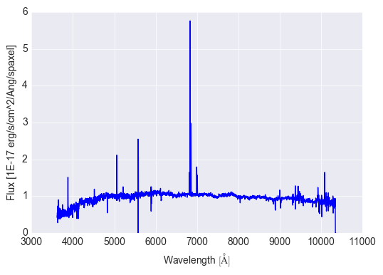

.. _marvin-modelcube:

ModelCube
=========

:ref:`marvin-tools-modelcube` is a class to interact with a DAP model data cube for a galaxy. First specify the galaxy that you want by creating a :ref:`marvin-tools-cube` object. If you have the DAP model cube file on your machine and in the expected directory (see :ref:`marvin-sasdir`), then you're good to go! If not, don't worry because Marvin will simply retrieve the data from the :ref:`marvin-databases` at Utah. Let's grab a model cube and plot the spectrum of its central spaxel.

::

    from marvin.tools.modelcube import ModelCube
    mc = ModelCube(mangaid='1-209232')
    mc[17, 17].model.plot()

.. image:: ../_static/modelspec_8485-1901_17-17.png

Here ``mc[17, 17]`` is a shorthand for ``mc.getSpaxel(x=17, y=17, xyorig='lower')``. This returns a :ref:`marvin-tools-spaxel` object. We then use the ``model`` attribute of the :ref:`marvin-tools-spaxel` object to get a :ref:`marvin-tools-spectrum` object that has a ``plot`` method to show the model spectrum.

::

    mc[17, 17].spectrum.plot()

We can also grab and plot the observed spectrum from the :ref:`marvin-tools-modelcube`.

If all of this jumping between Marvin objects is making your head spin, please consult this handy diagram: :ref:`visual-guide`.

|
