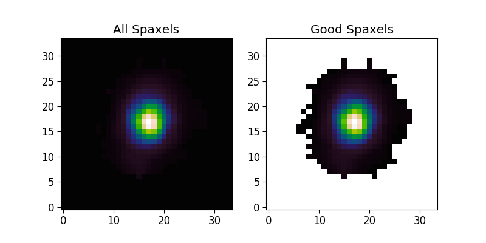

.. _marvin-bitmasks:

========
Bitmasks
========

Bitmask Descriptions
--------------------

- `DRP Bitmasks <http://www.sdss.org/dr13/algorithms/bitmasks/>`_

  - Galaxy targeting bits: `MANGA_TARGET1 <http://www.sdss.org/dr13/algorithms/bitmasks/#MANGA_TARGET1>`_ 

- `DAP bitmasks <https://trac.sdss.org/wiki/MANGA/TRM/TRM_MPL-5/DAPMetaData#Maskbits>`_

  - DAP spaxel quality bits: `MANGA_DAPPIXMASK <https://trac.sdss.org/wiki/MANGA/TRM/TRM_MPL-5/DAPMetaData#MANGA_DAPPIXMASK>`_

Using Bitmasks
--------------

Get a map:

.. code-block:: python

    from marvin.tools.maps import Maps
    galaxy = Maps(plateifu='8485-1901')
    ha = galaxy['emline_gflux_ha_6564']

Use the ``MANGA_DAPPIXMASK`` bitmasks to flag spaxels that we don't want to include:

.. code-block:: python

    unreliable = (ha.mask & 2**5) > 0
    donotuse = (ha.mask & 2**30) > 0

Combine masks:

.. code-block:: python

    import numpy as np
    bad_data = np.logical_or.reduce((unreliable, donotuse))

Create masked arrays for the good spaxels and regions that are masked by the DAP:

.. code-block:: python

    good_spax = np.ma.array(ha.value, mask=bad_data)

We can see the unmasked data (``ha.value``) on the left and the masked data (``good_spax``) on the right:

.. code-block:: python

    import matplotlib.pyplot as plt
    import marvin.utils.plot.colorbar as colorbar
    fig, axes = plt.subplots(ncols=2, figsize=(8, 4))
    values = (ha.value, good_spax)
    titles = ('All Spaxels', 'Good Spaxels')
    for ax, value, title in zip(axes, values, titles):
        ax.imshow(value, cmap=colorbar.linearlab()[0], origin='lower')
        ax.set_title(title)
    

|