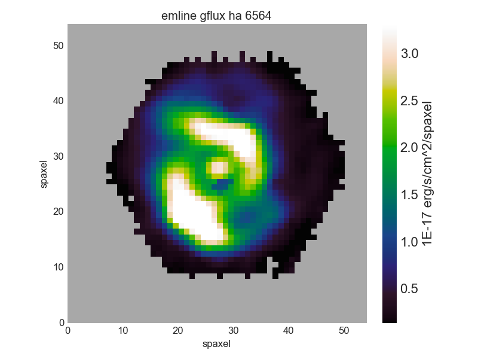
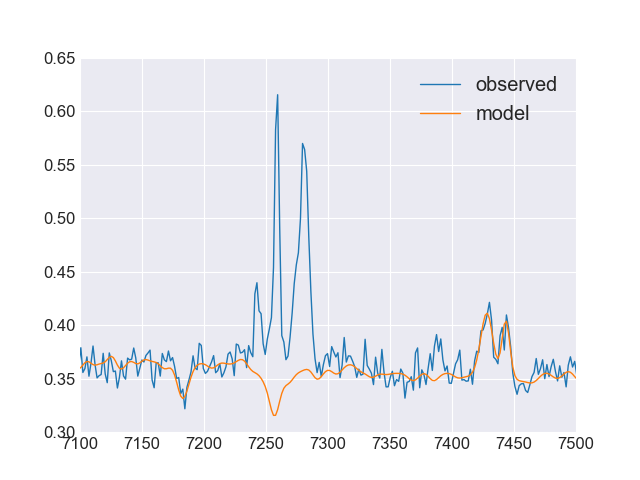
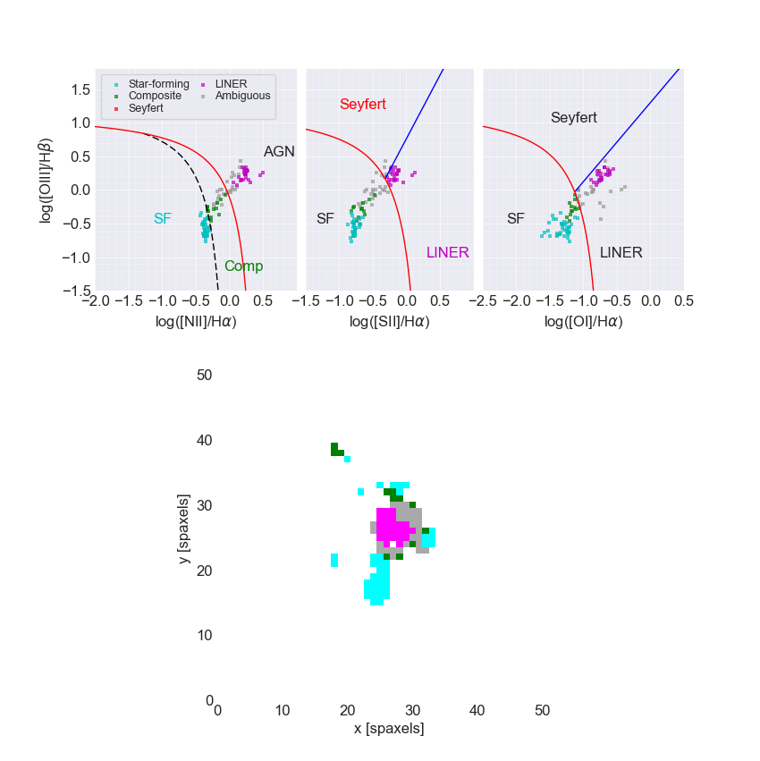
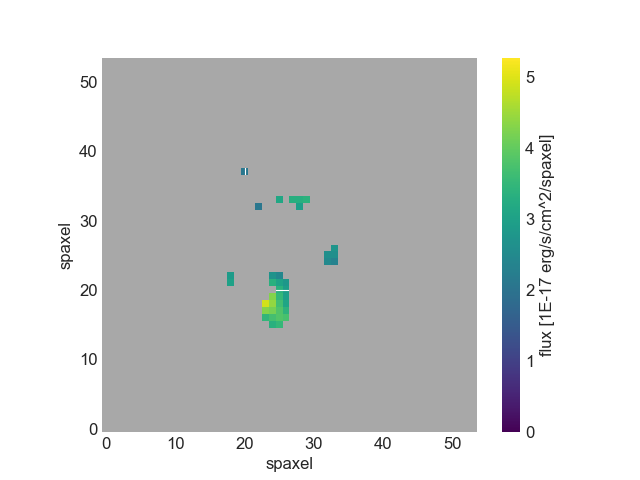
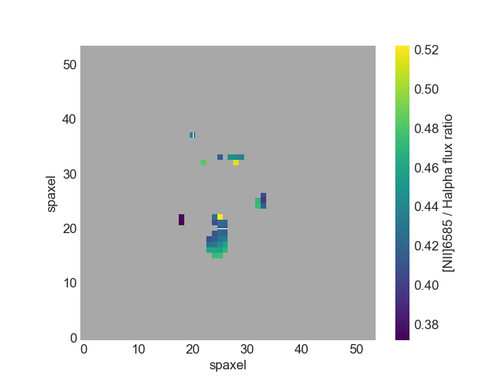

.. _marvin-lean-tutorial:

Lean Tutorial
=============

This tutorial runs through all of the steps for doing a project with Marvin from start-to-finish with no extra fat.  We recommend the use of `ipython` or `jupyter notebooks` when using Marvin.  You can start either from a terminal with `ipython` or `jupyter notebook`.

Project Description
-------------------

**Calculate the [NII]/H**\ :math:`\alpha` **ratio for star-forming spaxels in galaxies with stellar mass between** :math:`10^{10}` **and** :math:`10^{11}` **.**

Sample Selection
----------------

Marvin uses a simplified query syntax (in both `Web <https://dr15.sdss.org/marvin/search/>`_ and local queries) that understands the MaNGA database schema, so you don't have to write complicated SQL queries.

**Goal**: Find galaxies with stellar mass between :math:`10^{10}` and :math:`10^{11}`.

Create the query with :meth:`~marvin.tools.query.query.doQuery` and run it (limit to only 3 results for demo purposes):

.. code-block:: python

    from marvin.tools.query import doQuery
    q, r = doQuery(search_filter='nsa.sersic_logmass >= 10 and nsa.sersic_logmass <= 11', limit=3)

**Tip**: see :ref:`Marvin Query <marvin-query>` to learn the basics of querying.  See :ref:`Example Queries <marvin-query-examples>` and :ref:`Marvin Query Syntax Tutorial <marvin-sqlboolean>` for help with designing search filters.

View the :class:`~marvin.tools.query.results.Results`.  You may see a different set of results.  That is ok as long as you see some set of results.:

.. code-block:: python

    df = r.toDF()
    df
    #    mangaid  plate    plateifu   name  sersic_logmass
    # 0  1-24246   8626   8626-1902   1902       10.971793
    # 1  1-24482   8626  8626-12703  12703       10.706346
    # 2  1-24476   7990  7990-12705  12705       10.503103

Convert into :ref:`marvin-tools-maps` objects:

.. code-block:: python

    r.convertToTool('maps')
    r.objects
    galaxies = r.objects

Get the Maps
------------

Alternatively, maybe we already knew our galaxy IDs, which we can use to create :class:`~marvin.tools.maps.Maps` objects:

.. code-block:: python

    from marvin.tools.maps import Maps
    mangaids = ['1-245458', '1-22301', '1-605884']
    galaxies = [Maps(mangaid=mangaid) for mangaid in mangaids]

Get the H\ :math:`\alpha` maps:

.. code-block:: python

    haflux_maps = [galaxy['emline_gflux_ha_6564'] for galaxy in galaxies]

Plot H\ :math:`\alpha` map of the second galaxy:

.. code-block:: python

    haflux_map = haflux_maps[1]
    fig, ax = haflux_map.plot()

The dark blue region near the center of the galaxy looks suspicious, so let's take a look at the model fits of those spaxels.

The easiest way is to navigate to the `Galaxy page for 7992-6101 <https://dr15.sdss.org/marvin/galaxy/7992-6101>`_ and click on the red "Map/SpecView Off" button.

However, we can also plot the spectrum and model fits in Python. First, we can find the coordinates of a spaxel by moving our cursor around the interactive matplotlib plotting window. When the cursor is over the spaxel of interest, the coordinates will appear in the lower right.

Get Spectrum and Model Fit
--------------------------

Then we can create a :class:`~marvin.tools.spaxel.Spaxel` object by accessing the parent :class:`~marvin.tools.maps.Maps` object from the :class:`~marvin.tools.quantities.Map` object (``haflux_map.maps``) and retrieve the model fit.

.. code-block:: python

    spax = galaxies[1].getSpaxel(x=28, y=24, xyorig='lower', cube=True, modelcube=True)

Now let's plot the spectrum and model fit:

.. code-block:: python

    # Set matplotlib style sheet. Undo with matplotib.rcdefaults().
    import matplotlib.pyplot as plt
    plt.style.use('seaborn-darkgrid')

    ax = spax.flux.plot()
    ax.plot(spax.full_fit.wavelength, spax.full_fit.value)
    ax.legend(list(ax.get_lines()), ['observed', 'model'])
    ax.axis([7100, 7500, 0.3, 0.65])

Plot BPT Diagram
----------------

The :meth:`~marvin.tools.maps.Maps.get_bpt` returns masks for spaxels of different ionization types and the Figure object.

.. code-block:: python

    masks, fig, axes = galaxies[1].get_bpt()

For a detailed description see :doc:`../tools/bpt`.

Select Star-forming Spaxels
---------------------------

Select the star-forming spaxels that are in the star-forming region of each diagnostic diagram (hence the "global" keyword):

.. code-block:: python

    sf = masks['sf']['global']

Return the complement of the BPT global star-forming mask (``True`` means star-forming) using ``~`` and mark those spaxels as DONOTUSE since they are non-star-forming spaxels.

.. code-block:: python

    mask_non_sf = ~sf * haflux_map.pixmask.labels_to_value('DONOTUSE')

Do a bitwise OR between the DAP mask and the non-star-forming mask:

.. code-block:: python

    mask = haflux_map.mask | mask_non_sf

Plot with our new mask:

.. code-block:: python

    haflux_map.plot(mask=mask)

Plot [NII]/H\ :math:`\alpha` Flux Ratio for Star-forming Spaxels
----------------------------------------------------------------

Calculate [NII]6585/H\ :math:`\alpha` flux ratio:

.. code-block:: python

    maps_7992_6101 = galaxies[1]
    nii = maps_7992_6101['emline_gflux_nii_6585']
    ha = maps_7992_6101['emline_gflux_ha_6564']
    nii_ha = nii / ha

Plot the [NII]/H\ :math:`\alpha` flux ratio for the star-forming spaxels:

.. code-block:: python

    nii_ha.plot(mask=mask, cblabel='[NII]6585 / Halpha flux ratio')

Next Steps
----------

- :doc:`../getting-started` (more general introduction to Marvin)
- :doc:`plotting-tutorial`
- :doc:`Download Data <../core/downloads>` (avoid repeating the same remote API calls every time you run your script)

|
