.. _marvin-plotting-tutorial:


Plotting Tutorial
=================

.. _marvin-plotting-general:

General Tips
------------

Matplotlib Style Sheets
```````````````````````

Set Style Sheet
:::::::::::::::

.. code-block:: python

    import matplotlib.pyplot as plt
    plt.style.use('seaborn-darkgrid')


Restore Default Style
:::::::::::::::::::::

.. code-block:: python

    import matplotlib
    matplotlib.rcdefaults()


.. _marvin-plotting-quick-map:

Quick Map Plot
--------------

.. code-block:: python

    from marvin.tools.maps import Maps
    maps = Maps(plateifu='8485-1901')
    ha = maps['emline_gflux_ha_6564']
    ha.plot()

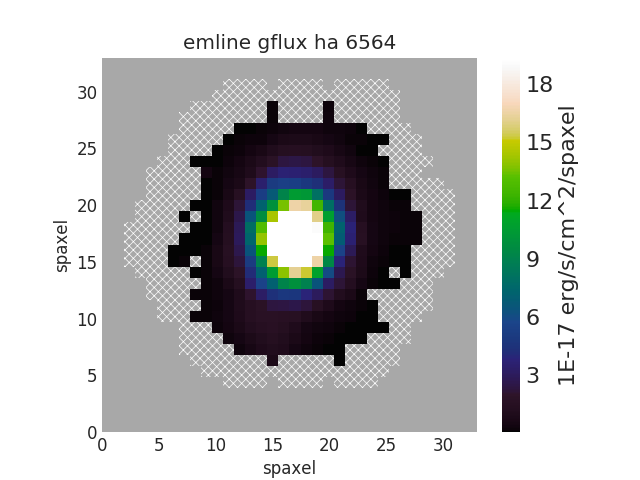


.. _marvin-plotting-quick-spectrum:

Quick Spectrum Plot
-------------------

.. code-block:: python

    from marvin.tools.maps import Maps
    maps = Maps(plateifu='8485-1901')
    spax = maps[17, 17]
    spax.flux.plot()

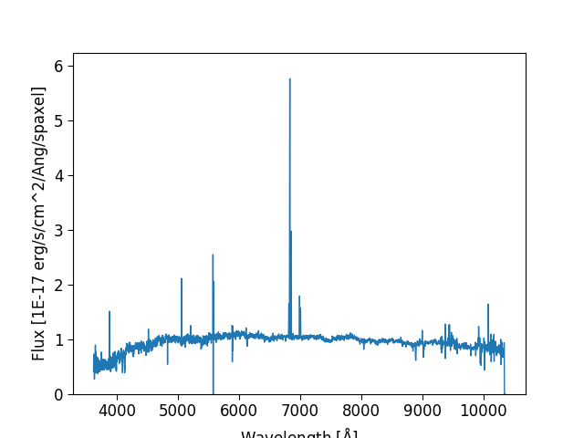


.. _marvin-plotting-quick-model-fit:

Quick Model Fit Plot
--------------------

.. code-block:: python

    from marvin.tools.maps import Maps
    maps = Maps(plateifu='8485-1901')
    # must use Maps.getSpaxel() to get modelcube
    # (the bracket slicing of Maps does not return the modelcube)
    spax = maps.getSpaxel(x=17, y=17, xyorig='lower', model=True)
    ax = spax.flux.plot()
    ax.plot(spax.full_fit.wavelength, spax.full_fit.value)
    ax.legend(list(ax.get_lines()), ['observed', 'model'])

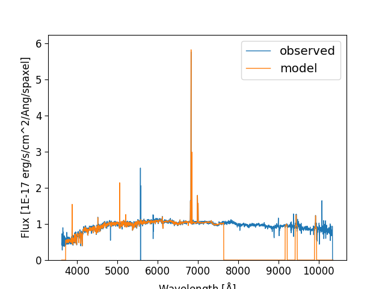


.. _marvin-plotting-quick-image:

Quick Image Plot
----------------

.. code-block:: python

    import matplotlib.pyplot as plt
    from marvin.utils.general.images import showImage
    image = showImage(plateifu='8553-12702', show_image=False)
    fig, ax = plt.subplots()
    ax.imshow(image)
    ax.axis('off')

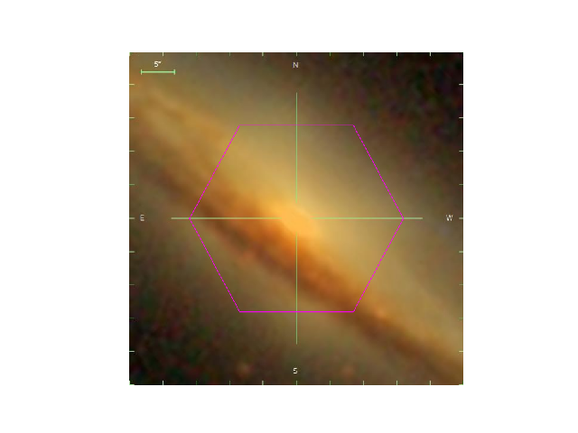


.. _marvin-plotting-bpt:

BPT Plot
--------

.. code-block:: python

    from marvin.tools.maps import Maps
    maps = Maps(plateifu='8485-1901')
    masks, fig, axes = maps.get_bpt()

.. image:: ../_static/bpt.png


.. _marvin-plotting-multipanel-single:

Multi-panel Map Plot (Single Galaxy)
------------------------------------

.. code-block:: python

    import matplotlib.pyplot as plt
    from marvin.tools.maps import Maps
    import marvin.utils.plot.map as mapplot
    plt.style.use('seaborn-darkgrid')  # set matplotlib style sheet

    maps = Maps(plateifu='8485-1901')
    stvel = maps['stellar_vel']
    ha = maps['emline_gflux_ha_6564']
    d4000 = maps['specindex_d4000']

    fig, axes = plt.subplots(1, 3, figsize=(15, 4))
    for ax, map_ in zip(axes, [stvel, ha, d4000]):
        mapplot.plot(dapmap=map_, fig=fig, ax=ax)

    fig.tight_layout()

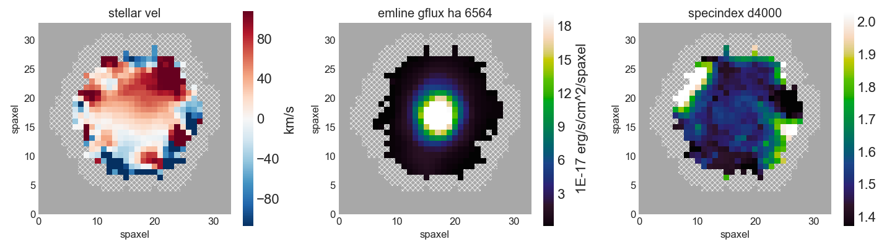


.. _marvin-plotting-multipanel-multiple:

Multi-panel Map Plot (Multiple Galaxies)
----------------------------------------

.. code-block:: python

    import matplotlib.pyplot as plt
    from marvin.tools.maps import Maps
    import marvin.utils.plot.map as mapplot
    plt.style.use('seaborn-darkgrid')  # set matplotlib style sheet

    plateifus = ['8485-1901', '8485-1902', '8485-12701']
    mapnames = ['stellar_vel', 'stellar_sigma']

    rows = len(plateifus)
    cols = len(mapnames)
    fig, axes = plt.subplots(rows, cols, figsize=(8, 12))
    for row, plateifu in zip(axes, plateifus):
        maps = Maps(plateifu=plateifu)
        for ax, mapname in zip(row, mapnames):
            mapplot.plot(dapmap=maps[mapname], fig=fig, ax=ax, title=' '.join((plateifu, mapname)))

    fig.tight_layout()

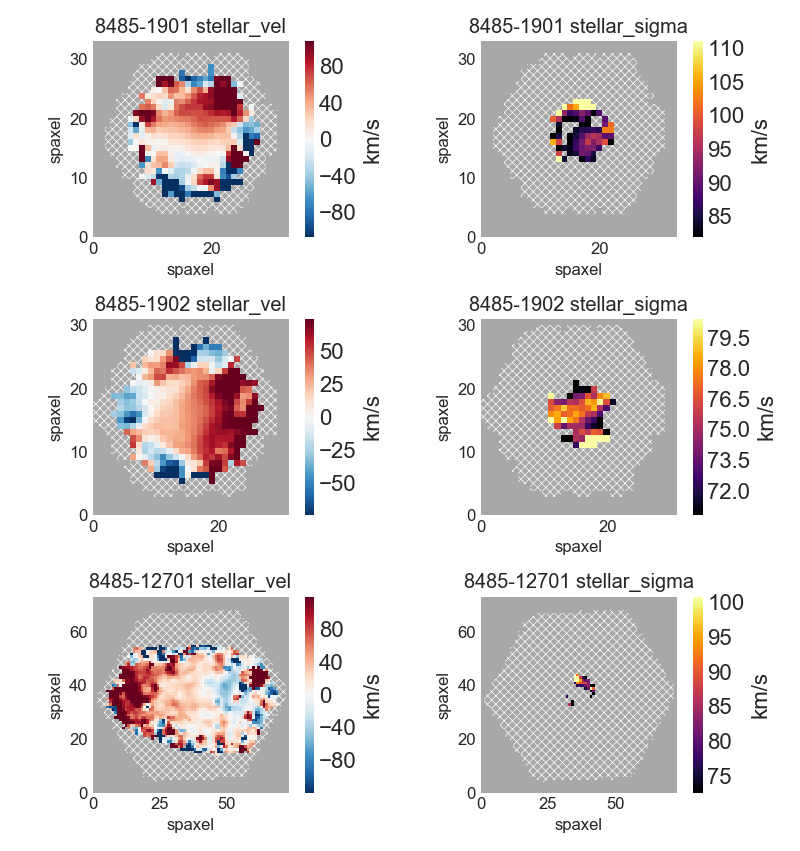


.. _marvin-plotting-zoom-in:

Zoom-in Map Plot
----------------


.. code-block:: python

    from marvin.tools.maps import Maps
    maps = Maps(plateifu='8485-1901')
    ha = maps['emline_gflux_ha_6564']

    fig, ax = ha.plot()
    ax.axis([13, 21, 13, 21])

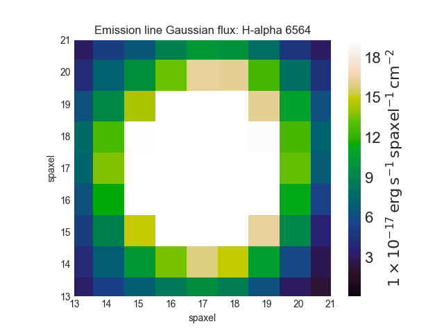


.. _marvin-plotting-custom-map-cbrange:

Custom Map Colorbar Range Options
---------------------------------

.. code-block:: python

    from marvin.tools.maps import Maps
    maps = Maps(plateifu='8485-1901')
    ha = maps['emline_gflux_ha_6564']

    fig, ax = ha.plot(percentile_clip=(1, 99))
    fig, ax = ha.plot(sigma_clip=2)
    fig, ax = ha.plot(cbrange=[2, 10])
    fig, ax = ha.plot(symmetric=True)
    fig, ax = ha.plot(log_cb=True)


.. _marvin-plotting-multipanel-matching-cbrange:

Multi-panel Map Plot with Matching Colorbar Ranges
--------------------------------------------------

.. code-block:: python

    import numpy as np
    import matplotlib.pyplot as plt
    from marvin.tools.maps import Maps
    import marvin.utils.plot.map as mapplot

    maps = Maps(plateifu='8485-1901')
    havel = maps['emline_gvel_ha_6564']
    stvel = maps['stellar_vel']
    vel_maps = [havel, stvel]

    cbranges = [vel_map.plot(return_cbrange=True) for vel_map in vel_maps]
    cb_max = np.max(np.abs(cbranges))
    cbrange = (-cb_max, cb_max)

    fig, axes = plt.subplots(ncols=2, figsize=(10, 4))
    for ax, vel_map in zip(axes, vel_maps):
        vel_map.plot(fig=fig, ax=ax, cbrange=cbrange)

    fig.tight_layout()

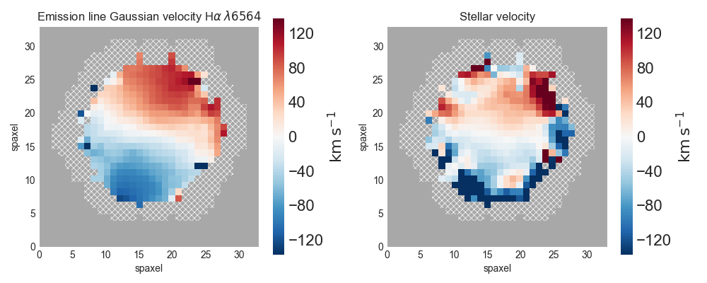


.. _marvin-plotting-custom-map-snr-min:

Custom Minimum Signal-to-Noise Ratio
------------------------------------

.. code-block:: python

    from marvin.tools.maps import Maps
    maps = Maps(plateifu='8485-1901')
    ha = maps['emline_gflux_ha_6564']

    # Default is 1 except for velocities, which default to 0.
    fig, ax = ha.plot(snr_min=10)

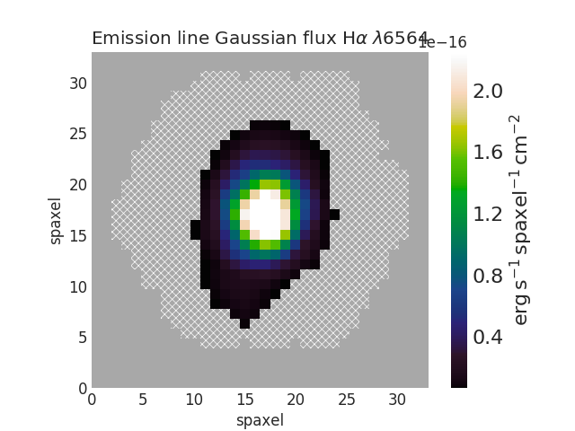


.. _marvin-plotting-custom-map-hatch:

Custom No Usable IFU Data Region
--------------------------------

.. code-block:: python

    from marvin.tools.maps import Maps
    maps = Maps(plateifu='8485-1901')
    ha = maps['emline_gflux_ha_6564']

    # Defaults:
    # gray background (facecolor=''#A8A8A8'),
    # white lines (edgecolor='w'),
    # dense hatching: (hatch= 'xxxx')

    # Custom: black background, cyan lines, less dense hatching
    fig, ax = ha.plot(patch_kws={'facecolor': 'k',
                                 'edgecolor': 'c',
                                 'hatch': 'xx'})

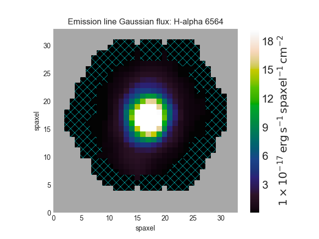


.. _marvin-plotting-custom-map-axes:

Custom Axis and Colorbar Locations for Map Plot
-----------------------------------------------

.. code-block:: python

    import matplotlib.pyplot as plt
    from marvin.tools.maps import Maps
    plt.style.use('seaborn-darkgrid')  # set matplotlib style sheet

    maps = Maps(plateifu='8485-1901')
    ha = maps['emline_gflux_ha_6564']

    fig = plt.figure()
    ax = fig.add_axes([0.12, 0.1, 2 / 3., 5 / 6.])
    fig, ax = ha.plot(fig=fig, ax=ax, cb_kws={'axloc': [0.8, 0.1, 0.03, 5 / 6.]})

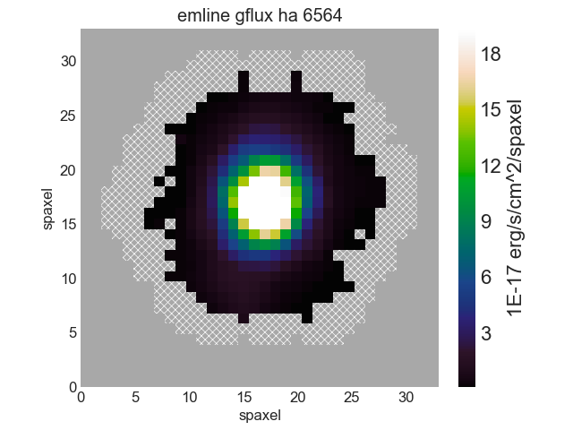


.. _marvin-plotting-custom-spectrum:

Custom Spectrum and Model Fit
-----------------------------

.. code-block:: python

    import matplotlib.pyplot as plt
    from marvin.tools.maps import Maps
    plt.style.use('seaborn-darkgrid')  # set matplotlib style sheet

    maps = Maps(mangaid='1-209232')
    spax = maps.getSpaxel(x=0, y=0, xyorig='center', model=True)

    fig, ax = plt.subplots()

    pObs = ax.plot(spax.flux.wavelength, spax.flux.value)
    pModel = ax.plot(spax.full_fit.wavelength, spax.full_fit.value)
    pEmline = ax.plot(spax.emline_fit.wavelength, spax.emline_fit.value)
    plt.legend(pObs + pEmline + pModel, ['observed', 'emline model', 'model'])

    ax.axis([6700, 7100, -0.1, 3])
    ax.set_xlabel('observed wavelength [{}]'.format(spax.flux.wavelength.unit.to_string('latex')))
    ax.set_ylabel('flux [{}]'.format(spax.flux.unit.to_string('latex')))


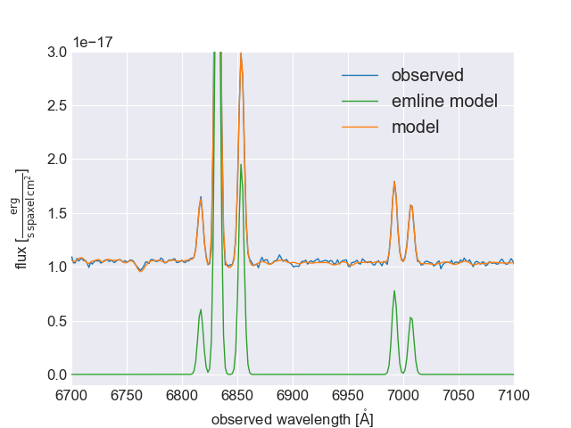


.. _marvin-plotting-map-starforming:

Plot H\ :math:`\alpha` Map of Star-forming Spaxels
--------------------------------------------------

.. code-block:: python

    import numpy as np
    from marvin.tools.maps import Maps
    maps = Maps(plateifu='8485-1901')
    ha = maps['emline_gflux_ha_6564']
    masks = maps.get_bpt(show_plot=False, return_figure=False)

    # Create a bitmask for non-star-forming spaxels by taking the
    # complement (`~`) of the BPT global star-forming mask (where True == star-forming)
    # and set bit 30 (DONOTUSE) for those spaxels.
    mask_non_sf = ~masks['sf']['global'] * ha.pixmask.labels_to_value('DONOTUSE')

    # Do a bitwise OR between DAP mask and non-star-forming mask.
    mask = ha.mask | mask_non_sf

    ha.plot(mask=mask)

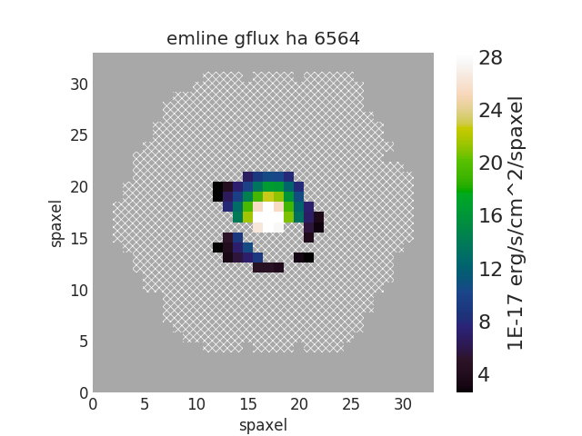


.. _marvin-plotting-niiha-map-starforming:

Plot [NII]/H\ :math:`\alpha` Flux Ratio Map of Star-forming Spaxels
-------------------------------------------------------------------

.. code-block:: python

    from marvin.tools.maps import Maps
    maps = Maps(plateifu='8485-1901')
    nii_ha = maps.getMapRatio(property_name='emline_gflux', channel_1='nii_6585', channel_2='ha_6564')

    # Mask out non-star-forming spaxels
    masks, __, __ = maps.get_bpt(show_plot=False)

    # Create a bitmask for non-star-forming spaxels by taking the
    # complement (`~`) of the BPT global star-forming mask (where True == star-forming)
    # and set bit 30 (DONOTUSE) for those spaxels.
    mask_non_sf = ~masks['sf']['global'] * ha.pixmask.labels_to_value('DONOTUSE')

    # Do a bitwise OR between DAP mask and non-star-forming mask.
    mask = nii_ha.mask | mask_non_sf

    nii_ha.plot(mask=mask, cblabel='[NII]6585 / Halpha flux ratio')

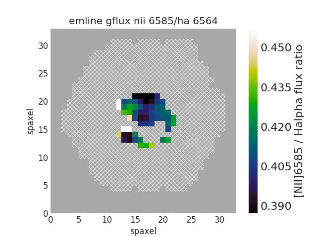


.. _marvin-plotting-qualitative-colorbar:

Qualitative Colorbar (New in version 2.1.4)
-------------------------------------------

.. code-block:: python

    import numpy as np
    from matplotlib import pyplot as plt
    from matplotlib.colors import ListedColormap
    from marvin.tools.maps import Maps
    import marvin.utils.plot.map as mapplot

    maps = Maps(plateifu='8485-1901')
    ha = maps['emline_gflux_ha_6564']

    # divide data into classes
    ha_class = np.ones(ha.shape, dtype=int)
    ha_class[np.where(ha.value > 5)] = 2
    ha_class[np.where(ha.value > 20)] = 3

    cmap = ListedColormap(['#104e8b', '#5783ad', '#9fb8d0'])
    fig, ax, cb = mapplot.plot(dapmap=ha, value=ha_class, cmap=cmap, cbrange=(0.5, 3.5),
                               title='', cblabel='', return_cb=True)
    cb.set_ticks([1, 2, 3])
    cb.set_ticklabels(['I', 'II', 'III'])

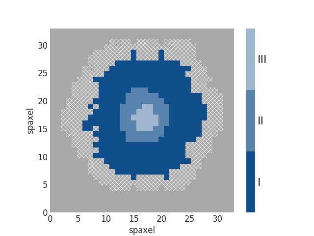


.. _marvin-plotting-custom-map-mask:

Custom Values and Custom Mask
-----------------------------

.. code-block:: python

    from marvin.tools.maps import Maps
    import marvin.utils.plot.map as mapplot

    maps = Maps(plateifu='8485-1901')
    ha = maps['emline_gflux_ha_6564']

    # Mask spaxels without IFU coverage
    # nocov = ha.mask & 2**0
    nocov = ha.pixmask.get_mask('NOCOV')

    # Mask spaxels with low Halpha flux
    low_ha = (ha.value < 6) * ha.pixmask.labels_to_value('DONOTUSE')

    # Combine masks using bitwise OR (`|`)
    mask = nocov | low_ha

    fig, ax = mapplot.plot(dapmap=ha, value=ha.value, mask=mask)

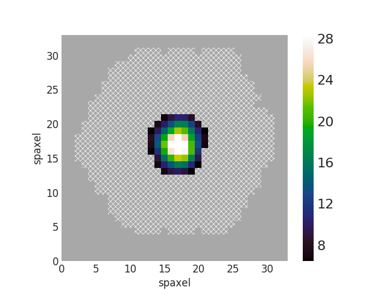

|
